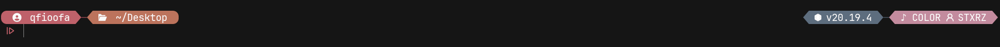
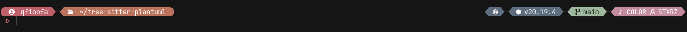
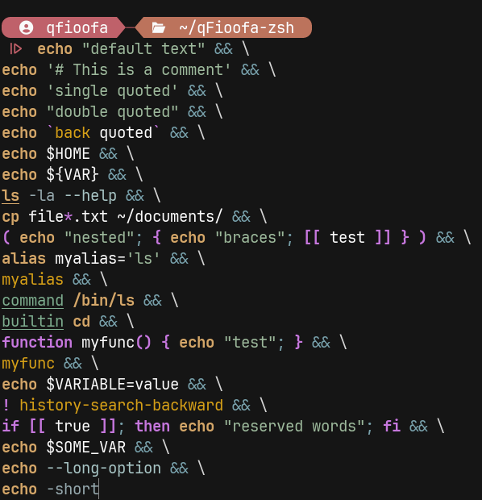
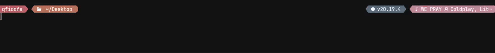

# qFioofa-zsh

Personal zsh config.

# Showcase

## Overview





## Syntax highlight



> Note: [file for testing terminal highlighs](./extra/highlight_test.bash)

## Music switch



# Install

Install the zsh throw package manager

```bash
sudo apt install zsh
```

- Make it the main shell

```bash
chsh -s $(which zsh)
```

- Enter password if needed
- Reload terminal
- Deploy from cloned repo

```bash
bash scripts/deploy.sh -r && exec zsh
```

# Plugins

The plugin manager is [zinit](https://github.com/zdharma-continuum/zinit)
Show status of plugin manager

```bash
zinit zstatus
```

## Prompt

```bash
sudo apt install starship
```

## Player

- Install universall Player

```bash
sudo apt install playerctl
```

# Nix

Ships a `flake.nix` exposing a Home Manager module (`homeManagerModules.default`).
It symlinks `./src` to `~/.config/zsh` via `xdg.configFile` and also writes a
`~/.zshenv` that sets `ZDOTDIR` so zsh loads `.zshrc` from there — the declarative
equivalent of `scripts/deploy.sh`.

```nix
# flake inputs
qFioofa-zsh.url = "github:qFioofa/qFioofa-zsh";

# home configuration
imports = [ qFioofa-zsh.homeManagerModules.default ];
```
